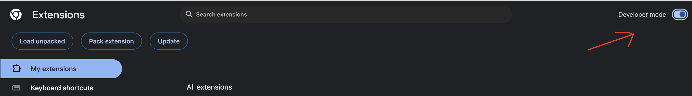
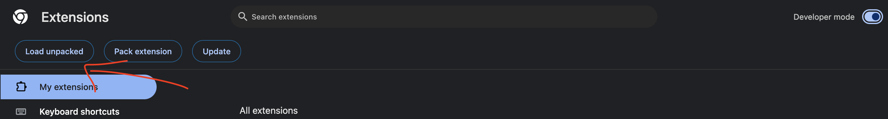
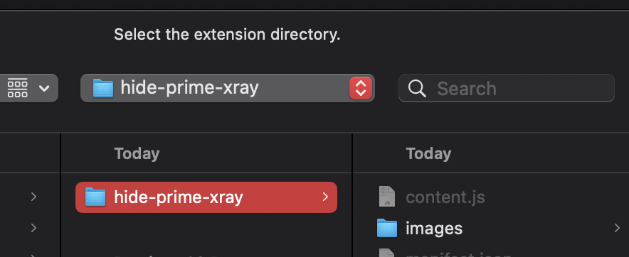

# Hide Amazon Prime's X-ray

## Overview:

Enhancing your Amazon Prime video experience is usually delightful, but the X-ray scene information during the pause screen can be distracting. Enter the solution: `hide-prime-xray`, a Chrome extension designed to seamlessly disable the X-ray feature.

## Installation:

### Step 1: Download the Code 📥

1. Click the "Code" button and download the ZIP file.
2. Unzip the file to your preferred location.

### Step 2: Load the Extension into Chrome 🌐

1. Open your Chrome browser and navigate to `chrome://extensions/`.
2. Enable developer mode in the top right corner of the page.

   

3. Click "Load Unpacked" in the top left corner.

   

4. Select the unzipped folder containing the extension.

   

### Step 3: Refresh Prime Video 🔄

1. Refresh your Prime Video site.
2. The X-ray panel will be completely hidden, providing a distraction-free viewing experience.

---

If you find this extension useful, consider showing your support by starring the repository. Thank you! 🌟🙏
